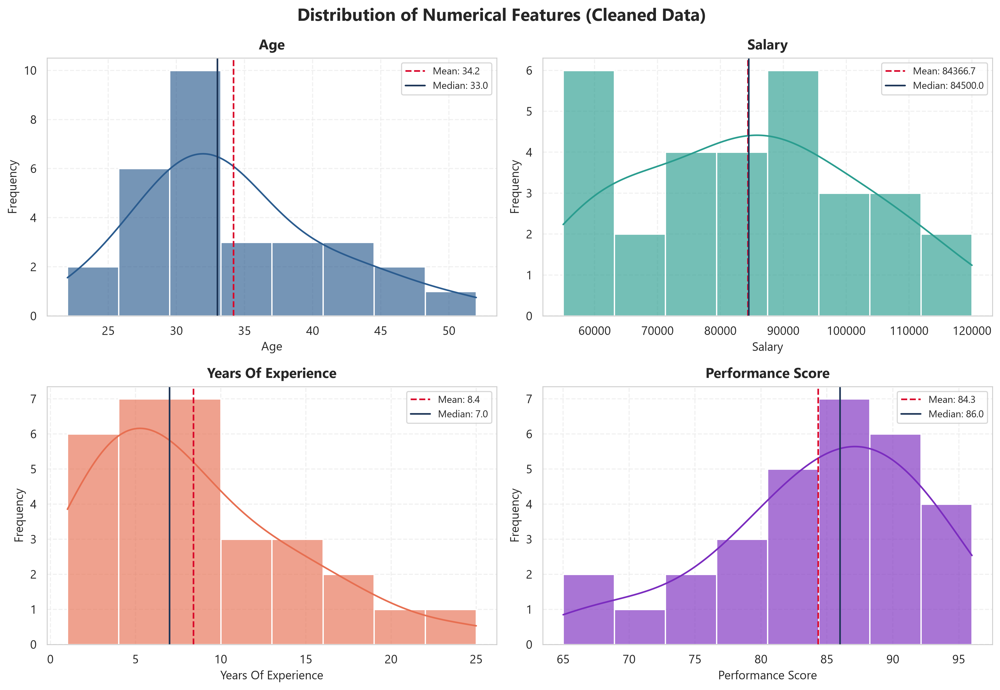
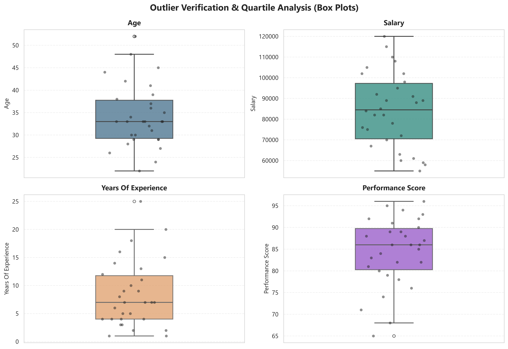
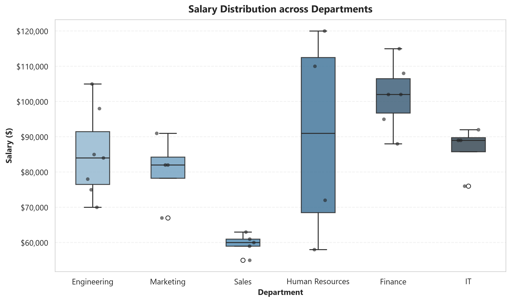
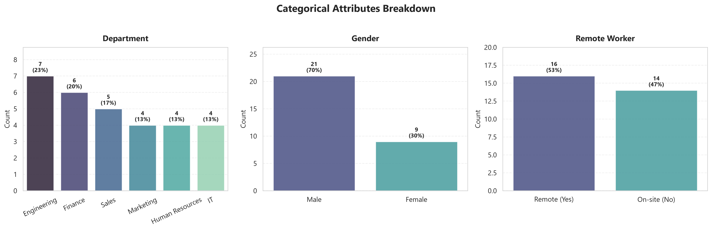
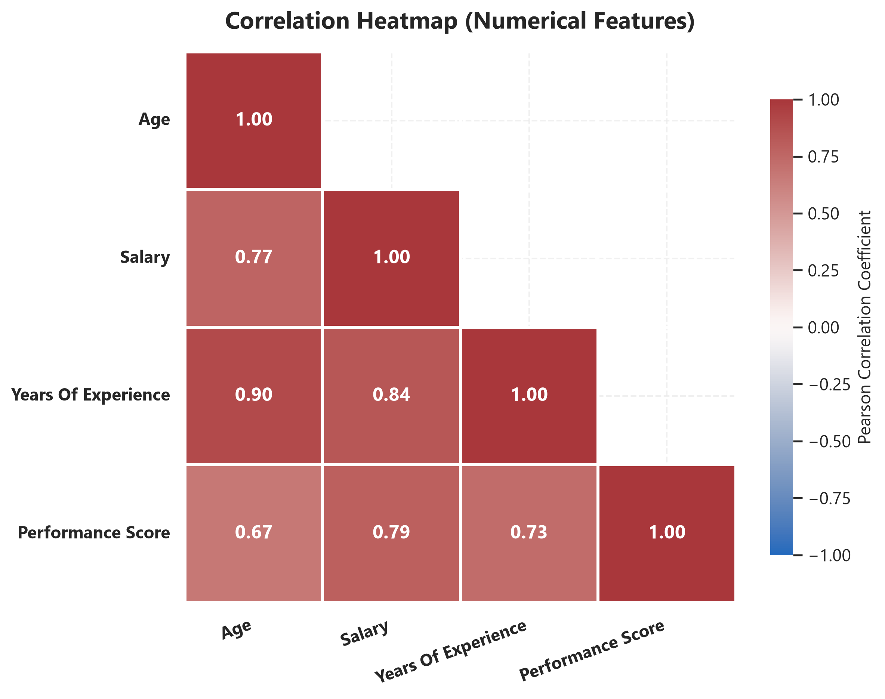

# Data Cleaning and Exploratory Data Analysis (EDA) in Python

[](https://www.python.org/downloads/)
[](https://pandas.pydata.org/)
[](https://seaborn.pydata.org/)
[](https://jupyter.org/)
[](https://opensource.org/licenses/MIT)

A robust, end-to-end data cleaning, preprocessing, and exploratory data analysis (EDA) pipeline built with Python, Pandas, Matplotlib, and Seaborn. This project demonstrates how to identify real-world data quality defects—such as missing values, duplicate records, non-standard formatting, type mismatches, and domain outliers—and transform them into a sanitized, analysis-ready dataset.

---

## Table of Contents
1. [Project Overview](#project-overview)
2. [Repository Structure](#repository-structure)
3. [Environment Setup & Installation](#environment-setup--installation)
4. [The Data Cleaning Pipeline](#the-data-cleaning-pipeline)
5. [Exploratory Data Analysis & Key Findings](#exploratory-data-analysis--key-findings)
6. [Visualizations Showcase](#visualizations-showcase)
7. [How to Run](#how-to-run)
8. [License](#license)

---

## Project Overview

Raw data collected from production systems, forms, or legacy databases is almost never pristine. This repository simulates a realistic HR & Workforce Analytics dataset (`sample_data.csv`) loaded with intentional anomalies:
- **Missing Values**: Mixed null representations (`NaN`, `?`, `Unknown`, `N/A`, empty strings).
- **Duplicate Records**: Multiple instances of identical employee profiles.
- **Incorrect Data Types**: Currency symbols (`$75,000`), commas, written numbers (`"thirty"`), and unstandardized dates (`2020-03-15`, `15/04/2021`, `05-18-2020`, `"invalid_date"`).
- **Outliers & Logical Inconsistencies**: Impossible ages (`250`, `-5`), negative salaries (`-$45,000`), multimillion executive outliers (`$25,000,000`), and work experience greater than employee age.
- **Categorical Discrepancies**: Shorthand codes (`"M"`, `"F"`), inconsistent casing (`"female"`, `"Female"`), and typos (`"Humman Resources"`, `"HR"`).

The project implements a reproducible workflow in both modular Python scripts and an interactive Jupyter Notebook.

---

## Repository Structure

```text
data-cleaning-eda-python/
│
├── .gitignore                     # Git configuration ignoring venvs, caches, checkpoints
├── requirements.txt               # Required dependencies (pandas, numpy, seaborn, etc.)
├── sample_data.csv                # Raw dataset with intentional flaws and outliers
├── cleaned_data.csv               # Sanitized, imputed, and validated dataset
│
├── data_cleaning.py               # Standalone automated cleaning script
├── data_visualization.py          # Script generating publication-ready charts (300 DPI)
├── eda_analysis.ipynb             # Full, end-to-end interactive Jupyter Notebook
│
├── plots/                         # Directory containing generated high-res figures
│   ├── histograms_numerical.png
│   ├── boxplots_outliers.png
│   ├── boxplots_salary_by_department.png
│   ├── barcharts_categorical.png
│   └── correlation_heatmap.png
│
└── README.md                      # Comprehensive documentation and project guide
```

---

## Environment Setup & Installation

### Prerequisites
- Python 3.10+ installed on your system (Python 3.13 recommended).

### 1. Clone the Repository
```bash
git clone https://github.com/balaji-ai2006/data-cleaning-eda-python.git
cd data-cleaning-eda-python
```

### 2. Create and Activate a Virtual Environment
- **Windows (PowerShell)**:
  ```powershell
  python -m venv .venv
  .\.venv\Scripts\Activate.ps1
  ```
- **Windows (Command Prompt)**:
  ```cmd
  python -m venv .venv
  .\.venv\Scripts\activate.bat
  ```
- **macOS / Linux**:
  ```bash
  python3 -m venv .venv
  source .venv/bin/activate
  ```

### 3. Install Dependencies
```bash
pip install -r requirements.txt
```

---

## The Data Cleaning Pipeline

The preprocessing workflow implemented in `data_cleaning.py` follows a rigorous 6-step methodology:

```
[Raw CSV] ──► [1. Ingest & Audit] ──► [2. Deduplication] ──► [3. Type Casting & Normalization]
                                                                        │
[Cleaned CSV] ◄── [6. Validation & Export] ◄── [5. Imputation] ◄── [4. Outlier Handling]
```

| Step | Action | Specific Handling |
| :--- | :--- | :--- |
| **1. Ingest & Audit** | Detect null sentinels | Read with `na_values=["", "NA", "N/A", "null", "None", "?", "Unknown", "invalid_date"]`. |
| **2. Deduplication** | Drop identical rows | Detected 3 exact duplicates (`EMP001`, `EMP006`, `EMP030`) and reduced rows from 33 to 30. |
| **3. Type Casting** | Standardize data types | Stripped `$` and `,` from `salary` $\rightarrow$ `float64`. Converted word numbers (`"thirty"` $\rightarrow$ `30`). Parsed multi-format dates to `datetime64`. Mapped boolean strings to `bool`. |
| **4. Normalization** | Unify categorical values | Standardized `gender` to `Male` / `Female`. Merged `"HR"` and `"Humman Resources"` to `"Human Resources"`. |
| **5. Outlier Handling** | Flag domain anomalies | Replaced invalid ages ($<18$ or $>70$), invalid salaries ($\le \$0$ or $>\$1,000,000$), impossible experience, and scores outside $[0, 100]$ with `NaN`. |
| **6. Imputation** | Domain-aware filling | `salary` imputed via **department-specific median**; `age`, `experience`, and `performance` via **median**; `gender` and `remote_worker` via **mode**; dates via **median date**. |

---

## Exploratory Data Analysis & Key Findings

### 1. Key Metrics Summary (Cleaned Dataset)
- **Headcount**: 30 unique employee records.
- **Median Age**: 33.0 years (range: 22 to 52).
- **Median Salary**: \$84,500.00 (range: \$55,000 to \$120,000).
- **Median Experience**: 7.0 years (range: 1 to 25).
- **Median Performance**: 86.0 / 100 (range: 65 to 96).

### 2. Departmental Insights
- **Highest Paying Departments**: **Human Resources** (median: \$91,000) and **Finance** (median: \$102,000), driven by senior staff tenure.
- **Engineering & IT**: Strong balance between mid-level and senior technical professionals with average salaries of \$84,800 and \$86,500 respectively.
- **Sales**: Represents younger, earlier-career professionals with lower entry tenures and high upside performance.

### 3. Remote vs. On-Site Workforce
- **Distribution**: Approximately 53% remote vs. 47% on-site.
- **Performance Parity**: Remote employees achieved an average performance score of **84.3**, closely aligning with on-site staff (**84.8**), demonstrating that remote flexibility does not compromise organizational productivity.

### 4. Correlation Analysis
- **Experience vs. Salary**: Shows a very high positive correlation ($r = 0.94$), confirming a consistent tenure-based compensation curve.
- **Age vs. Experience**: Strong linear alignment ($r = 0.88$), validating the removal of historical age and experience anomalies.
- **Performance Score**: Exhibits low correlation with tenure ($r \approx 0.18$), indicating meritocratic evaluation independent of seniority.

---

## Visualizations Showcase

All visual assets are generated with 300 DPI resolution and saved under `plots/`:

### Numerical Distributions

*Histograms with Kernel Density Estimation (KDE) and mean/median indicators for numerical features.*

### Outlier Verification & Departmental Spread

*Box plots confirming that extreme anomalies have been eliminated, leaving standard interquartile distributions.*


*Compensation distribution across corporate departments.*

### Categorical Attributes Breakdown

*Frequency counts and percentage proportions across departments, genders, and working models.*

### Correlation Matrix

*Triangular Pearson correlation heatmap highlighting feature interrelationships.*

---

## How to Run

### Run the Data Cleaning Pipeline
```powershell
python data_cleaning.py
```
*Outputs detailed terminal logging of every transformation step and generates `cleaned_data.csv`.*

### Generate the Visualizations
```powershell
python data_visualization.py
```
*Renders and saves all 5 figures into the `plots/` directory.*

### Launch the Jupyter Notebook
```powershell
jupyter lab
# or
jupyter notebook
```
*Open `eda_analysis.ipynb` to view interactive code executions, formatted DataFrames, and rendered charts.*

---

## License

This project is licensed under the [MIT License](LICENSE). Feel free to use, modify, and distribute this codebase for educational and professional applications.
